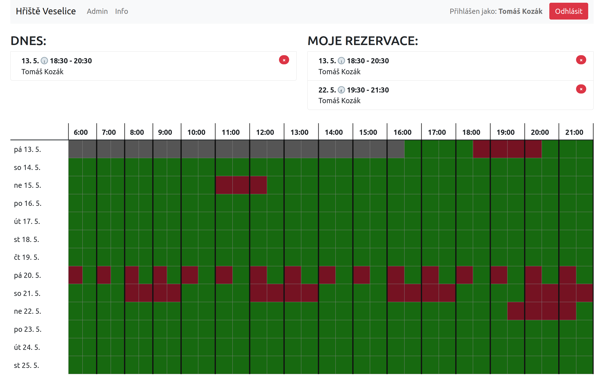

# CRS - court reservation system

## Application

Reservation system for courts, playgrounds or anything else...

## Key features:

- user registration based on secret password
- user login
- slots reservation
    - day is separated to 48 slots (30 min)
    - max slots in row could be limited
    - days to future could be limited
    - reservation cancellation
    - day range could be limited
- management
    - admin account (user/reservation management)
- responsive design
    - mobile
    - tablet
    - desktop
- high security level

## Used production infrastructure

- Frontend - [CloudFlare pages][cloudflare]
- Backend - [Google Cloud Run][cloudrun]
- Databáze - [Google Firestore][firestore]

[cloudflare]: https://pages.cloudflare.com/

[cloudrun]: https://cloud.google.com/run

[firestore]: https://firebase.google.com/docs/firestore

